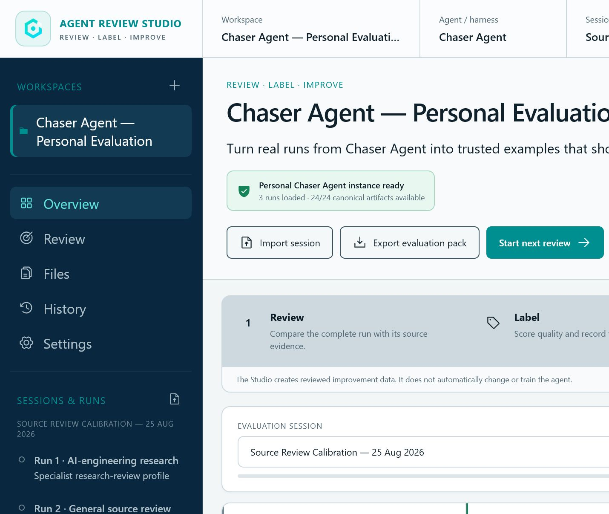

# Agent Review Studio

Agent Review Studio is a local-first evaluation workbench for AI agents and agent harnesses. It lets an operator define repeatable test cases, run a versioned harness, inspect the complete execution trace, label individual claim failures, compare a baseline with a candidate, and preserve every human judgment as evidence for future regression testing.

Chaser Agent is the built-in demonstration workspace. It is not the product identity; any agent, harness, workflow or service can have its own named workspace.

**Live application:** [agent-review-studio.chaseintech.chatgpt.site](https://agent-review-studio.chaseintech.chatgpt.site)



Version 1.1 adds the execution and evaluation layer that was missing from the first review-only release. The built-in Chaser Agent workspace now includes real source provenance, a repeatable Cloudflare calibration case, a bounded local runner, categorical claim judgments, version tracking, pairwise comparison, automated evaluators, reviewer calibration and configurable CI gates.

## What process is this?

This is **agent evaluation, human labelling, evidence curation and harness refinement**. It prepares trusted improvement data; it is not automatic model-weight fine-tuning.

The review output can improve:

- prompts and system instructions;
- workflow and orchestration logic;
- retrieval, evidence and provenance handling;
- tool-selection and approval policies;
- memory admission rules;
- golden cases, regression suites and future training datasets.

Model fine-tuning may later consume carefully selected review data, but this application currently changes neither model weights nor imported source artifacts.

## Working capabilities

- A prominent workspace switcher, agent/harness identity, one-step workspace creation, reversible archive/restore and deliberately constrained empty-workspace removal.
- Versioned datasets and immutable test cases with source text, primary URL, expected behaviour, privacy class and tags.
- An integrated run console with a browser-local deterministic runner, optional localhost runner bridge and import-only boundary.
- Append-only harness and configuration versions carrying a workflow profile plus commit or build reference.
- New immutable runs with nine retained artifacts: eight canonical review files plus the original source.
- Automated bundle, provenance, relevance, context, action-specificity and trace evaluators that never populate human scores.
- An operator overview with session progress, a deterministic run queue and a clear next-review action.
- Bundle diagnostics for canonical artifact presence, parse failures, identity consistency, unique IDs and resolvable claim/evidence/action/uncertainty links.
- Multiple agent-agnostic workspaces with editable project, agent and reviewer identities.
- Dated sessions and run groups for repeat reviews over time.
- Folder and loose-file import.
- A complete artifact browser with filtering, role detection, parse state, table preview, image/PDF preview where the browser supports it, raw text/JSON preview and download-copy actions.
- A canonical operator-review order for human packet, claims, evidence, source card, actions, memory, uncertainty and run log, with unknown files retained afterwards.
- Canonical review mapping for human packet, claims, evidence, source, actions, memory, uncertainty and trace artifacts.
- Retention of unfamiliar supporting files instead of silent discard.
- Paired claim/evidence review with surrounding context, a primary-source link and exact local source-line navigation.
- Per-claim categorical judgments including Supported and relevant, Not a claim, Irrelevant, Missing context, Unsupported, Misclassified, Duplicate, Needs external verification and Linked action is unrelated.
- Required corrections for claim-level issue labels, kept separate from five once-per-run product-quality scores.
- A full execution-trace tree alongside action, memory and uncertainty review.
- Explicit operator confirmation for the review contract, source card, every classified claim/evidence pair, actions, memory, uncertainty and run log before completion.
- Five once-per-run quality ratings on a 0–3 scale, a final decision and correction notes.
- A complete rating rubric with dimension-specific 0–3 anchors; correction notes are required for Needs revision and Fail.
- Resumable drafts.
- Immutable review revisions, JSON export, linked re-review and score-change history.
- Session-level evaluation-pack export with diagnostics, latest operator revisions and an explicit completion summary.
- Exact isolation of development-QA seed records from genuine operator progress.
- Baseline-versus-candidate metrics and a separate immutable pairwise preference.
- Aggregate evaluator metrics, failure taxonomy, multi-reviewer agreement and configurable CI regression gates.
- A System inspector that exposes implemented algorithms, data structures, complexity and Year Two computer-science links while marking backpropagation as future work.
- A 15-step guided tour that navigates the actual workspace lifecycle, datasets, runner, claim labels, comparison, metrics, files, history and system inspector.
- Persistent light and dark themes for extended evidence reading and focused operator sessions.
- A responsive desktop, tablet and phone layout with contained headers, stacked mobile controls and drawer navigation.
- IndexedDB storage for imported run bundles and binary attachments; local browser storage for identities, drafts and revision records.

## File compatibility

The current adapter registry supports:

| Group | Formats | Behaviour |
| --- | --- | --- |
| Structured data | JSON, JSONL, NDJSON, YAML, YML, TOML | JSON and JSON Lines are parsed; other structured text is previewed and retained. |
| Tables | CSV, TSV | Browser table preview plus raw retention. |
| Documents and logs | Markdown, TXT, LOG, XML, HTML | Safe text preview; HTML is not executed. |
| Source code | JS/TS, Python, SQL, shell, PowerShell and common language/config extensions | Read-only text preview. |
| Visual evidence | PNG, JPG, JPEG, WebP, GIF, SVG, PDF | Safe browser preview when supported; otherwise retained for download. |
| Other attachments | Any extension | Stored as an immutable binary attachment with metadata and download-copy access. |

The detailed adapter and normalization contract is in [docs/ARTIFACT_COMPATIBILITY.md](docs/ARTIFACT_COMPATIBILITY.md).

## Run locally

```powershell
npm install
npm run dev -- --host 127.0.0.1 --port 4173
```

Open the address printed by Vite. Data remains in the browser profile on this computer.

The browser-local runner needs no second process. To test the bounded localhost bridge in another terminal:

```powershell
npm run runner
```

The bridge binds to `127.0.0.1:4318`, accepts only localhost Studio origins, creates a new immutable bundle and performs no provider call, external action, memory promotion or model training.

## Verification

```powershell
npm test
npm run build
```

The test suite covers adapter aliases, JSON Lines recovery, nested run grouping, deterministic diagnostics, claim-label contracts, ranked extraction, immutable run creation, automated evaluators, baseline comparison, reviewer agreement, CI gates, revision lineage and Sites packaging. Browser interaction and real Chaser Agent runner proof are recorded in [design-qa.md](design-qa.md).

## Data and safety boundary

- Imported artifacts are read-only evidence.
- Finishing a review creates a new review revision and exports JSON; it never rewrites the imported bundle.
- Re-review links a new revision to its parent instead of overwriting the earlier judgement.
- No provider call, external tool action, memory promotion, training job or deployment is authorized by a review.
- Version 1.1 remains local-first. The localhost bridge is a bounded single-operator adapter, not a hosted multi-user execution service. Authentication, queues, rate limiting and network context transport remain a later governed HTTP/server phase.

## Open-source release

Version 1.0 is licensed under Apache-2.0 and includes contribution and security policies. The source is public at [github.com/chasedndt/agent-review-studio](https://github.com/chasedndt/agent-review-studio), and the working application is deployed through OpenAI Sites. The package remains `private: true` to prevent accidental npm registry publication; that flag does not limit source-code use under the repository license.

## Engineering map

- [Artifact compatibility](docs/ARTIFACT_COMPATIBILITY.md)
- [Review revision model](docs/REVIEW_REVISION_MODEL.md)
- [Phase 2 implementation record](docs/PHASE2_IMPLEMENTATION.md)
- [Operator completion implementation record](docs/PHASE3_OPERATOR_COMPLETION.md)
- [Version 1.0 release record](docs/PHASE4_RELEASE.md)
- [Version 1.0.2 identity, responsive and Chaser-instance record](docs/PHASE6_BRAND_RESPONSIVE_CHASER_INSTANCE.md)
- [Version 1.1 industry workbench implementation](docs/PHASE7_INDUSTRY_WORKBENCH.md)
- [Chaser Agent case-study and redaction contract](docs/CHASER_CASE_STUDY_REDACTION.md)
- [Documentation index](docs/index.md)
